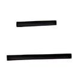
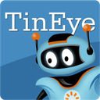

# PicImageSearch

**Aggregated Image Search Engine for Reverse Image Search**

## What is PicImageSearch?

PicImageSearch is a powerful Python image search library that integrates multiple mainstream reverse image search engines, providing developers with a unified and concise API interface, making the development of image search functions more convenient.

## Project History

### Project Origin

This project initially originated from my need to develop an image search function on the [OPQ](https://github.com/opq-osc/OPQ) QQ robot platform.  
At that time, I found that the image search service APIs on the market were relatively scattered and implemented in different ways, which brought many inconveniences to development.  
To solve this problem, I developed PicImageSearch, which integrates multiple excellent image search engines into a unified interface, greatly simplifying the development process.

### Project Development

During the development of the project, [Neko Aria](https://github.com/NekoAria) joined the development team after being introduced to the [NoneBot2](https://github.com/nonebot/nonebot2) platform.  
He comprehensively refactored the code, introducing more modern design concepts, significantly improving the maintainability and scalability of the project.  
Currently, the project is mainly maintained by Neko Aria, continuously providing the community with better image search solutions.

## Supported Reverse Image Search Engines

- { .lg .middle } AnimeTrace

    ---

    以图识番 - 在线 AI 识番引擎 | 日漫识别 | 动漫查询 | 动漫基因库

- { .lg .middle } Ascii2D

    ---

    二次元画像詳細検索

- { .lg .middle } BaiDu

    ---

    百度图片

- { .lg .middle } Bing

    ---

    Bing Images

- { .lg .middle } Copyseeker

    ---

    The Best Free AI Powered Reverse Image Search Like No Other

- { .lg .middle } E-hentai

    ---

    E-Hentai Galleries

- { .lg .middle } Google

    ---

    Google Images

- { .lg .middle } Google Lens

    ---

    Google Lens

- { .lg .middle } Iqdb

    ---

    Multi-service image search

- { .lg .middle } Lenso

    ---

    Lenso.ai - AI Reverse Image Search

- { .lg .middle } SauceNAO

    ---

    SauceNAO Reverse Image Search

- { .lg .middle } Tineye

    ---

    TinEye Reverse Image Search

- { .lg .middle } TraceMoe

    ---

    Anime Scene Search Engine

- { .lg .middle } Yandex

    ---

    Yandex Images

## Contributors to this project

- { .lg .middle } Neko Aria

    ---

    Project Maintainer

- { .lg .middle } kitUIN

    ---

    Project Owner

- { .lg .middle } Peloxerat

    ---

    Project Contributor

- { .lg .middle } lleans

    ---

    Project Contributor

- { .lg .middle } chinoll

    ---

    Project Contributor

- { .lg .middle } Nachtalb

    ---

    Project Contributor

